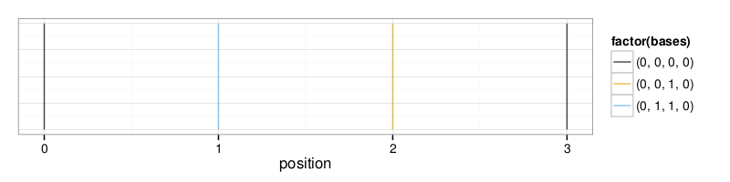

# Multiple sequence alignment (MSA) classifier

## Background

Multiple sequence alignments (MSAs) can be used to resolve breakpoints of
structural variants by aligning sequences in breakpoint regions and looking for
transitions between regions "outside" the variant and "inside" the variant.

The MSA classifier facilitates this breakpoint resolution by classifying each
column in a given MSA by the relative similarity of rows in the column. For
example, columns with complete identity are identified by a single integer and a
tuple of enumerated bases. The following example shows a four-sequence alignment
of four bases followed by the enumerated base representation of each column and
then by the enumeration of that column type in the context of the whole
alignment.

```
A A T T
A G T T
A G - T
A A T T

0 0 0 0
0 1 0 0
0 1 1 0
0 0 0 0

0 1 2 0
```

## Usage

Classify a MSA.

```bash
python classify_msa_columns.py alignment.fasta alignment_classification.tab
```

The output reports the alignment position, single integer enumeration of that
position's column, and the base enumeration of the column.

```
position column_type bases
0        0           (0, 0, 0, 0)
1        1           (0, 1, 1, 0)
2        2           (0, 0, 1, 0)
3        0           (0, 0, 0, 0)
```

Visualize the alignment classification using
[ggplot](http://docs.ggplot2.org/current/) with one vertical line per position
colored according to the column classification.

```bash
Rscript plot_msa.R alignment_classification.tab alignment_classification.pdf
```

The output should look similar to the following figure.



For the purposes of breakpoint resolution, not all columns are
relevant. Classification results can be filtered by providing a list of column
types to report. In the following example, only columns with identical rows or
identical outer and inner rows are reported.

```bash
python classify_msa_columns.py alignment.fasta alignment_classification.tab --types 0000 0110
```

Note that the column types must be specified in the enumerated base format
without any comma delimiters. Multiple types can be provided in a
space-delimited list.

## Requirements

 * Python (2.7.2 or later)
 * BioPython (1.6.5 or later)
 * R (2.15.0 or later)
 * ggplot (0.9.2.1 or later)
